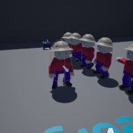

# Project Name  ThirdPerson

## Description

A github repository for the in class demonstration of replacing the default mannequin, and allowing user to toggle 1st/3rd person view.   
 
Attributions: 
1. Biped create in class by S Benoit

## Usage
Clone, or download the zip, to a local directory. Open in Unreal Engine 4.27 or newer

